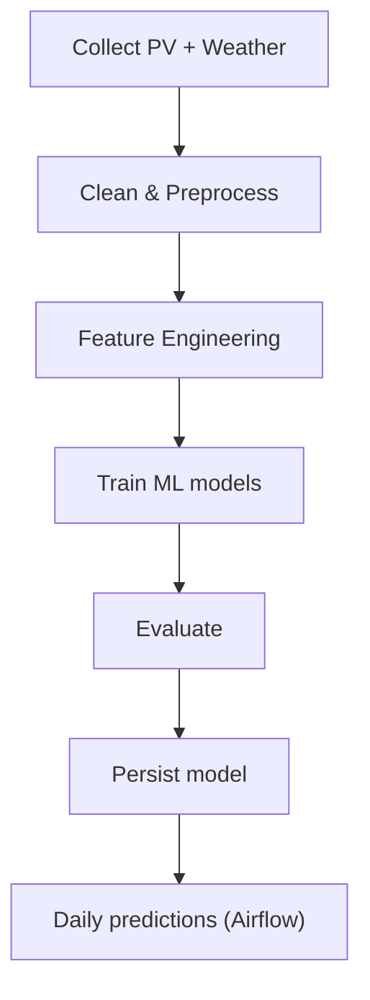

# 🌞 Solar Radiation Prediction — Machine Learning + Airflow (Astro)

[](#)
[](#)
[](#)
[](#)

**Objectif.** Prédire la production/radiation solaire horaire à partir de données météo (ERA5/Open-Meteo) et PV.  
Le repo montre : **expérimentation ML**, **orchestration Airflow (Astro)**, et **setup reproductible** (Docker, requirements, tests).


## Pipeline (vue d’ensemble)


---

## 🔹 Structure du projet
```markdown
## Structure du projet
.
├── dags/
│ ├── solar_radiation_prediction.py # DAG Airflow principal
│ └── exampledag.py # Exemple (amovible)
├── include/
│ └── ml_pipeline.py # ETL / ML / évaluation / prédiction
├── tests/ # Tests (pytest)
├── requirements.txt # Dépendances Python
├── packages.txt # Dépendances OS (optionnel)
├── Dockerfile # Image Airflow + deps
├── airflow_settings.yaml # Variables/connexions Airflow
└── README.md
```
## Lancer en local (Astro)

### Prérequis
- Python **3.10+**
- Docker Desktop
- **Astro CLI** (Astronomer)

### Démarrer
```bash
git clone git@github.com:LYT-ctrl/solar-radiation-prediction.git
cd solar-radiation-prediction
astro dev start

```
UI Airflow : http://localhost:8080
Activer le DAG : solar_radiation_prediction


---

## 🔹  Données & Prétraitement
```markdown
## Données & Prétraitement

- **Cible** : `kWh` (production PV)
- **Features** (exemples) : `temperature_2m`, `relativehumidity`, `windspeed_10m`, `windgusts_10m`,
  `precipitation`, `cloudcover`, `surface_pressure`, `elevation`, `sunrise/sunset`,
  + variables temporelles (`year`, `month`, `day`, `hour`).
- **Étapes** : fusion PV↔météo par timestamp/site, traitement des NA, engineering temporel & métier.
```

## Modèles & Métriques

- **Modèles** : LinearRegression, BayesianRidge, DecisionTree, RandomForest, SVR *(MLP optionnel)*
- **Métriques** : **R²**, **MAE**, **MSE**, **RMSE**

| Modèle            |  MSE |  RMSE |   MAE |   R²  |
|-------------------|-----:|------:|------:|------:|
| Linear Regression |  580 | 24.08 | 18.37 | 0.149 |
| Decision Tree     |  607 | 24.65 | 17.62 | 0.109 |
| Random Forest     |  596 | 24.43 | 17.56 | 0.125 |
| SVR               |  675 | 25.98 | 15.84 | 0.009 |
| Bayesian Ridge    |  580 | 24.08 | 18.37 | 0.149 |
| MLP Regressor     |  554 | 23.54 | 17.78 | 0.187 |

> **Conclusion** : les modèles non-linéaires font légèrement mieux (R² ≈ 0.18–0.19).  
> Prochaines pistes : **TimeSeriesSplit**, features trigonométriques (sin/cos heure/jour), lags/rolling, XGBoost/LightGBM + tuning.

## Orchestration Airflow (DAG)

Séquence des tâches :
1. `load_and_clean_data` — ingestion PV + météo, nettoyage
2. `feature_selection` — sélection de variables
3. `train_model` — entraînement base-lines, choix du meilleur
4. `evaluate_model` — R² / MAE / MSE / RMSE
5. `save_model` — persistance (`joblib`)
6. `predict` *(à ajouter)* — **prédictions quotidiennes** à partir du dernier modèle


## Roadmap
- TimeSeriesSplit (validation temporelle) + tuning (RF/SVR/MLP)
- Features avancées : saisonnalité trigonométrique, lags/rolling windows
- Baselines **XGBoost / LightGBM**
- Dashboard **Streamlit**
- API légère **FastAPI** (serve/predict) ou model registry
- Déploiement cloud (batch scoring)

## Auteur
**Yacine Tigrine** — M2 IA & Ingénierie  
GitHub : https://github.com/LYT-ctrl


